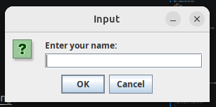
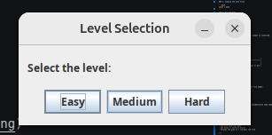
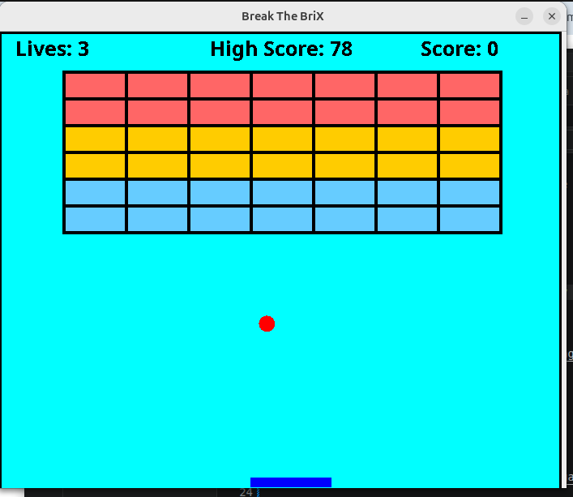

# Break The BriX

**Break The BriX** is a Java Swing-based brick breaker game developed as a small university project and later improved with cleaner code structure, better gameplay mechanics, difficulty balancing, high score saving, power-ups, and stronger brick behavior.

The goal of the game is simple: control the paddle, keep the ball alive, break all bricks, and score as high as possible.

---

## Demo Screenshots

> Add or replace these screenshots manually later.

### Start / Player Setup



### Level Selection



### Gameplay



---

## Features

- Player name input
- Difficulty selection: Easy, Medium, and Hard
- Score system
- High score system
- High score saved locally in a file
- Different brick strengths
- Multiple-hit bricks
- Power-up system
- Temporary paddle-size power-up
- Ball speed increases as bricks are destroyed
- Paddle size changes based on difficulty
- Lives system
- Game over screen
- Win screen
- Restart option
- Java Swing-based GUI
- Keyboard controls

---

## Gameplay Mechanics

### Difficulty Levels

| Difficulty | Paddle Size | Brick Layout | Ball Behavior |
| ---------- | ----------: | ------------ | ------------- |
| Easy       |       Large | Fewer bricks | Slower/easier |
| Medium     |      Normal | More bricks  | Balanced      |
| Hard       |       Small | More bricks  | Faster/harder |

### Brick Strengths

Bricks can require multiple hits before being destroyed.

| Brick Type   | Hits Required | Description         |
| ------------ | ------------: | ------------------- |
| Weak Brick   |         1 hit | Breaks immediately  |
| Medium Brick |        2 hits | Needs two ball hits |
| Strong Brick |        3 hits | Hardest brick type  |

### Power-Ups

Sometimes a broken brick drops a green power-up.  
If the paddle catches it, the paddle becomes wider for a short time.

### High Score

The game saves the highest score in:

```text
highscore.txt
```

This file is created automatically when the game saves a score.

---

## Technologies Used

- Java
- Java Swing
- Java AWT
- Object-Oriented Programming
- File handling
- Event handling
- Basic game loop using Swing Timer

---

## Project Structure

```text
BreakTheBriX/
├── Main.java
├── GamePanel.java
├── BrickMap.java
├── GameConfig.java
├── HighScoreManager.java
├── PowerUp.java
├── README.md
├── screenshots/
│   ├── start-screen.png
│   ├── gameplay.png
│   ├── power-up-gameplay.png
│   ├── game-over.png
│   └── win-screen.png
├── highscore.txt
└── .gitignore
```

> Note: `highscore.txt` is generated automatically after playing. It does not need to be manually created.

---

## How to Run

### 1. Clone the Repository

```bash
git clone https://github.com/your-username/break-the-brix.git
```

### 2. Go to the Project Folder

```bash
cd break-the-brix
```

### 3. Compile the Java Files

```bash
javac *.java
```

### 4. Run the Game

```bash
java Main
```

---

## How to Run in VS Code

1. Open VS Code.
2. Click **File → Open Folder**.
3. Select the project folder.
4. Make sure the **Extension Pack for Java** is installed.
5. Open the terminal in VS Code.
6. Run:

```bash
javac *.java
java Main
```

---

## Controls

| Key         | Action                         |
| ----------- | ------------------------------ |
| Left Arrow  | Move paddle left               |
| Right Arrow | Move paddle right              |
| Enter       | Restart after game over or win |

---

## Screenshots to Add Later

Create a folder named:

```text
screenshots
```

Then add screenshots using these exact file names:

```text
start-screen.png
gameplay.png
power-up-gameplay.png
game-over.png
win-screen.png
```

After adding the images, GitHub will automatically show them in this README.

---

## Future Improvements

- Add background music
- Add sound effects
- Add pause and resume feature
- Add multiple levels
- Add main menu screen
- Add custom themes
- Add more power-up types
- Add enemy or obstacle blocks
- Package the game as a runnable JAR file

---

## What I Learned

Through this project, I practiced:

- Java Swing GUI development
- Object-oriented programming
- Collision detection
- Keyboard event handling
- Game state management
- File handling for saving high scores
- Refactoring a small university project into a more structured project

---

## Author

Created by **Humayra** as a university project and later improved as a portfolio project.

---

## License

This project is open for learning and personal portfolio use.
